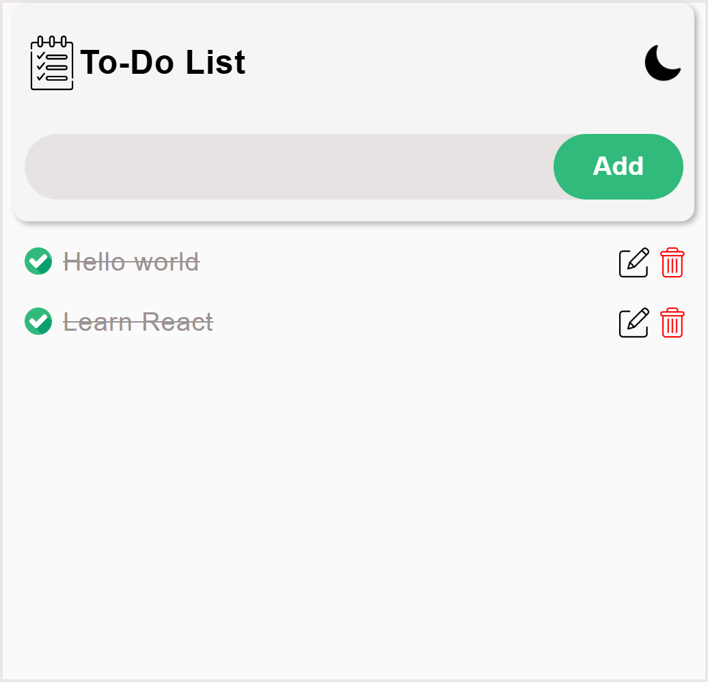
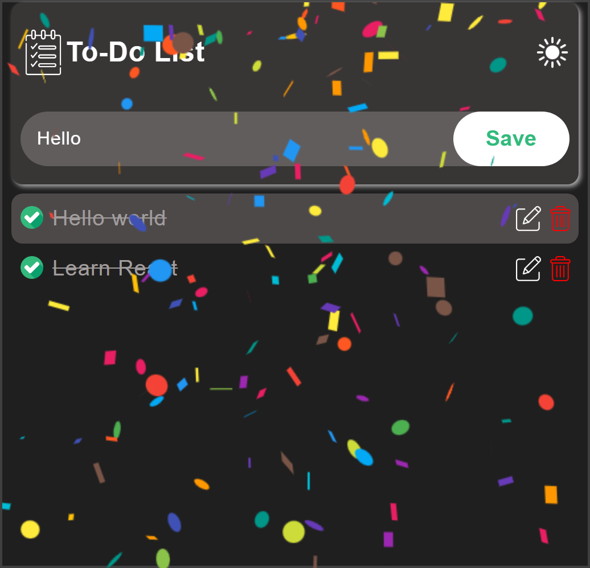

# To-Do List Application

## 🔗[Live Demo](https://todo-app-obiora-kingsleys-app.vercel.app/)

## Description

This is a feature-rich To-Do List application built with React that allows users to:
- Add, edit, and delete tasks
- Mark tasks as complete/incomplete
- Toggle between light and dark themes
- View tasks with a "show more/show less" functionality for long text
- Experience a confetti celebration when all tasks are completed
- Persist todos and theme preference in localStorage
- Responsive design with intuitive UI

The app includes custom icons for different states and themes, and provides visual feedback for user interactions.
## 📸


## 📸


## Features

- ✨ Add, edit, and delete tasks
- ✅ Mark tasks as complete/incomplete
- 🌓 Toggle between light and dark themes
- 📝 "Show more/show less" functionality for long task descriptions
- 🎉 Confetti celebration when all tasks are completed
- 💾 Persistent storage using localStorage
- ⌨️ Keyboard support (Enter key to add/save tasks)

---

## 🛠️ Tech Stack
- **Frontend**: [React/HTML/CSS]
- **Styling**: [CSS]  
- **Deployment**: [Vercel]  

---

## Installation

1. Clone the repository:
   ```bash
   git clone https://github.com/your-username/todo-list-app.git
   ```

2. Navigate to the project directory:
   ```bash
   cd todo-list-app
   ```

3. Install dependencies:
   ```bash
   npm install
   ```

4. Start the development server:
   ```bash
   npm start
   ```

## Usage

1. Type your task in the input field and press "Add" or Enter key
2. Click the checkbox to mark a task as complete
3. Click the edit icon to modify a task
4. Click the delete icon to remove a task
5. Toggle the theme icon in the top-right corner to switch between light/dark modes
6. Click "..." on long tasks to expand/collapse the full text

## Dependencies

- React
- React DOM
- React Confetti (for celebration effect)

## Folder Structure

```
/src
  /assets
    /images       # Contains all application icons
  /components    # React components
    Todo.js      # Main component
    TodoItems.js # Individual todo item component
    Confetti.js  # Celebration component
```

## Contributing

Pull requests are welcome. For major changes, please open an issue first to discuss what you would like to change.
